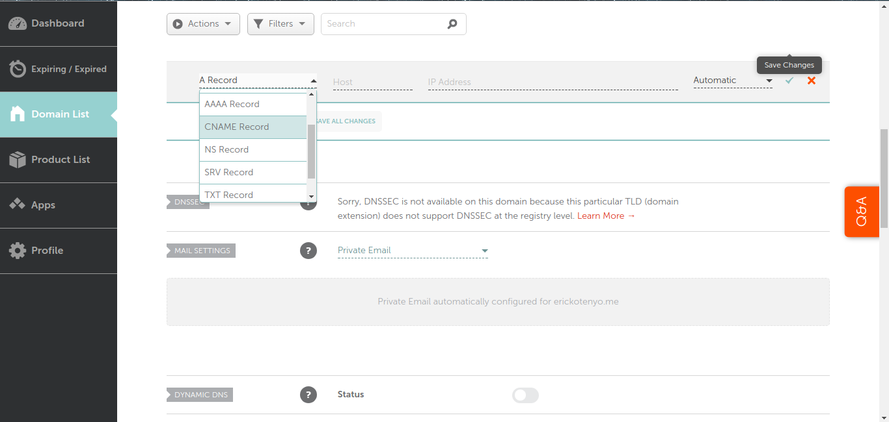
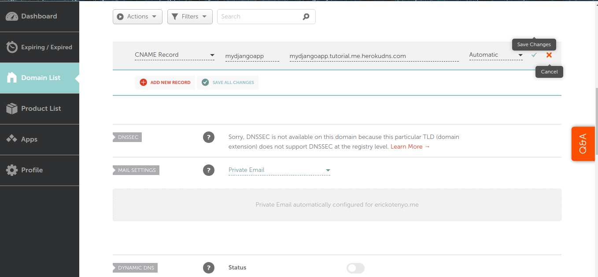

# heroku-subdomain
How to Host Sites on a Subdomain with Heroku

# Set up Heroku
Before the content can show up on your site, it needs to be on Heroku. I’m not going to go into how to deploy a site to Heroku, but for this guide you can use any language. I will use python-Django. 

Deploy you app to heroku, lets say you deploy it to my-django-app.herokuapp.com

# Set up your DNS provider
To put content on a subdomain, you need to own a domain name.(I use namecheap)
You also need a way to manage your domain’s DNS. I use the namecheap DNS manager.

I am going to assume you have Namecheap setup and your domain name is tutorial.me

# Connecting your domain to your Heroku app

To point your subdomain at Heroku, add a CNAME record in Namecheap

A CNAME is like a symlink in Unix. It says that the canonical name (C NAME) of domain A is actually this other domain B, so when someone visits domain B, show the content of domain A. It’s exactly what we want.

Host should be the subdomain that you want to add, for example say we want to use 'mydjangoapp.tutorial.me', we will enter mydjangoapp

We will fill the other field in a moment, after we explicitly setup the sub-domain in heroku.

# Add the sub-domain To your Heroku app  via Heroku CLI

From  your teminal type the following command to add the subdomain to your Heroku app. You will need to install and setup the Heroku CLI if you dont have it.

    $ heroku domains:add mydjangoapp.tutorial.me --app my-django-app
  
This should respond with something like:

    Adding mydjangoapp.tutorial.me to ⬢my-django-app... done
    ▸    Configure your app's DNS provider to point to the DNS Target mydjangoapp.tutorial.me.herokudns.com.
     ▸    For help, see https://devcenter.heroku.com/articles/custom-domains

    The domain mydjangoapp.tutorial.me has been enqueued for addition
     ▸    Run heroku domains:wait 'mydjangoapp.tutorial.me' to wait for completion
      
We will want to copy the DNS Target provided by heroku and add it to Namecheap as below:

Leave the last field as it is (Automatic).

Finally save the changes and in less than 5 minutes you should be having your sub-domain working and linking to your django app on Heroku.

Cheers !
